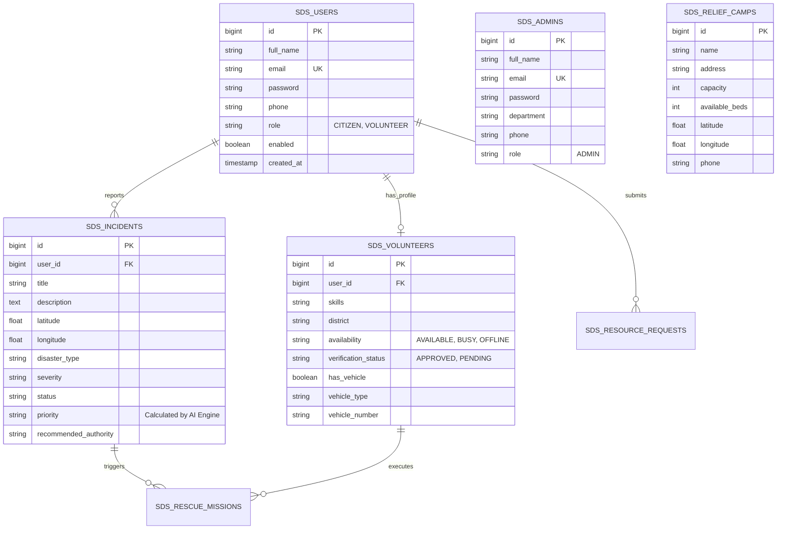

# 🚨 Kerala Smart Disaster Management System (KSDMS)

<div align="center">


<br/>


**An intelligent, unified emergency response platform connecting citizens, registered rescue volunteers, and state disaster management authorities across Kerala.**

[🌐 Live Demo](https://empty-moose-mate.loca.lt) • [🚀 1-Click Deploy to Render](https://render.com/deploy?repo=https://github.com/Soulofghost/smart-disaster-management) • [📄 Technical Blueprint PDF](https://github.com/Soulofghost/smart-disaster-management/blob/main/docs/README_REPLICATION.md)

</div>

---

## 📌 Table of Contents
- [🌟 Platform Overview](#-platform-overview)
- [⚡ Key Features & Core Modules](#-key-features--core-modules)
- [🔑 Demo Accounts & Access Matrix](#-demo-accounts--access-matrix)
- [🏗️ System Architecture & Data Flow](#%EF%B8%8F-system-architecture--data-flow)
- [🗄️ Database Architecture & Entity Schema](#%EF%B8%8F-database-architecture--entity-schema)
- [🚀 Quick Start & Installation](#-quick-start--installation)
- [☁️ Cloud Deployment Guide (Render, Netlify, Docker)](#%EF%B8%8F-cloud-deployment-guide-render-netlify-docker)
- [🔌 Complete API Endpoint Reference](#-complete-api-endpoint-reference)
- [🔒 Security & Data Isolation](#-security--data-isolation)
- [📄 License & Authors](#-license--authors)

---

## 🌟 Platform Overview

The **Kerala Smart Disaster Management System (KSDMS)** is an enterprise-grade emergency mitigation platform designed for high-consequence natural disaster scenarios (floods, landslides, cyclones). Built with **Spring Boot 3.2**, **Thymeleaf**, **Bootstrap 5**, **Leaflet GIS**, and **Supabase PostgreSQL**, the platform provides:

- **Instant Geotagged Incident Reporting & 1-Tap Emergency SOS**
- **AI-Powered Priority Scoring & Automated Authority Dispatch**
- **Interactive GIS Map with Live Relief Shelter Bed Capacities**
- **Complete Emergency Directory Across All 14 Kerala Districts**
- **Multi-Role Security Architecture (`ADMIN`, `VOLUNTEER`, `CITIZEN`)**

---

## ⚡ Key Features & Core Modules

### 🚨 1. Emergency SOS & Citizen Response Center
- **One-Tap Emergency SOS**: Broadcasts current GPS coordinates (`latitude`, `longitude`) to the state command center with `CRITICAL` priority.
- **Geotagged Incident Reporting**: Submit disaster reports with photos, disaster categories (Flood, Landslide, Fire, Medical), and severity ratings.
- **Relief Supply Requests**: Order essential emergency supplies (Food, Water, First Aid, Sandbags) with live delivery status tracking.

### 🛡️ 2. Rescue Volunteer Portal
- **Verification Workflow**: Volunteers register skills (Medical, Swimming, Search & Rescue), district assigned, and transport capabilities (4x4 SUV, Boat, Ambulance).
- **Duty Readiness Toggle**: One-click status switch (`AVAILABLE`, `BUSY`, `OFFLINE`).
- **Mission Queue**: Accept, claim, and update rescue mission statuses (`PENDING`, `IN_PROGRESS`, `COMPLETED`).

### 📊 3. State Command Center (Admin Dashboard)
- **AI Priority Engine**: Rule-based AI algorithm that categorizes incoming reports (`CRITICAL`, `HIGH`, `MEDIUM`, `LOW`) and suggests responding agencies (NDRF, Fire & Rescue, Coast Guard, Police).
- **Real-Time Visual Analytics**: Interactive Chart.js graphs displaying incident distributions by severity and district.
- **Broadcast Alerts**: Broadcast emergency red/orange weather warnings to citizen dashboards.
- **Data Export**: 1-click CSV data export for official disaster reports.

### 🗺️ 4. Interactive GIS Map & 30-in-1 Mega Portal
- **Relief Camp Tracker**: Real-time Leaflet map displaying camp capacity, available beds, contact numbers, and directions.
- **District Emergency Directory**: 50+ helpline contacts covering Police Stations, Fire Stations, Hospitals, and Collectorates across all 14 Kerala districts.
- **Integrations**: Live Open-Meteo weather forecasts, dam water level monitors, CMDRF donation portal, missing persons registry, and fake news fact-checker.

---

## 🔑 Demo Accounts & Access Matrix

Upon initial startup, `DataInitializer.java` automatically seeds the database with the following demo credentials:

| Role | Email | Password | Access Rights | Redirect Route |
|---|---|---|---|---|
| **State Admin** | `admin@ksdma.gov.in` | `admin123` | Full Command Center, Analytics, Broadcasts, Mission Assignments | `/dashboard/admin` |
| **Rescue Volunteer** | `volunteer@ksdma.gov.in` | `volunteer123` | Duty Status, Rescue Mission Queue, Vehicle Management | `/dashboard/volunteer` |
| **Citizen** | `citizen@ksdma.gov.in` | `citizen123` | Disaster Reporting, SOS Alerting, Relief Requests, Camp Maps | `/dashboard/citizen` |

---

## 🏗️ System Architecture & Data Flow

```mermaid
graph TD
    %% User Roles
    Citizen((Citizen))
    Volunteer((Volunteer))
    Admin((State Admin))

    %% Web UI Layer
    subgraph Frontend (Thymeleaf + Bootstrap 5 + Leaflet GIS)
        C_Dash[Citizen Dashboard]
        V_Dash[Volunteer Dashboard]
        A_Dash[Admin Command Center]
        GIS_Map[Interactive Live Map]
    end

    %% Backend Service Layer
    subgraph Backend (Spring Boot 3.2 MVC)
        Security[Spring Security 6]
        AuthHandler[Custom Authentication Handler]
        Controllers[MVC Controllers]
        Services[Business Logic & AI Priority Engine]
        Repos[Spring Data JPA Repositories]
    end

    %% Database Layer
    subgraph Database (Supabase PostgreSQL / H2)
        AdminsDB[(sds_admins)]
        UsersDB[(sds_users)]
        VolunteersDB[(sds_volunteers)]
        IncidentsDB[(sds_incidents)]
        CampsDB[(sds_relief_camps)]
    end

    %% Flow Connections
    Citizen -->|Login / Register| Security
    Volunteer -->|Login / Register| Security
    Admin -->|Login| Security

    Security --> AuthHandler
    AuthHandler -->|ADMIN| A_Dash
    AuthHandler -->|VOLUNTEER| V_Dash
    AuthHandler -->|CITIZEN| C_Dash

    C_Dash --> Controllers
    V_Dash --> Controllers
    A_Dash --> Controllers
    GIS_Map --> Controllers

    Controllers --> Services
    Services --> Repos
    Repos --> AdminsDB
    Repos --> UsersDB
    Repos --> VolunteersDB
    Repos --> IncidentsDB
    Repos --> CampsDB
```

---

## 🗄️ Database Architecture & Entity Schema



---

## 🚀 Quick Start & Installation

### Prerequisites
- **Java 21** or higher (`java -version`)
- **Maven 3.8+** (`mvn -version`)
- **PostgreSQL** Database (or built-in H2 for instant offline testing)

### 1. Clone the Repository
```bash
git clone https://github.com/Soulofghost/smart-disaster-management.git
cd smart-disaster-management
```

### 2. Configure Database Connection
Edit `src/main/resources/application.properties` to connect your PostgreSQL or Supabase instance:
```properties
spring.datasource.url=jdbc:postgresql://<YOUR_HOST>:5432/postgres?sslmode=require
spring.datasource.username=<YOUR_USER>
spring.datasource.password=<YOUR_PASSWORD>
```

*(Note: To run in offline mode with zero database setup, use `--spring.profiles.active=h2`)*

### 3. Build & Run
```bash
# Run unit & integration tests
mvn test

# Package Spring Boot executable JAR
mvn clean package -DskipTests

# Start the application
java -jar target/smart-disaster-management-0.0.1-SNAPSHOT.jar
```

Open your browser at **`http://localhost:8080`**.

---

## ☁️ Cloud Deployment Guide (Render, Netlify, Docker)

### 1-Click Render Cloud Deployment
Click the button below to deploy the Spring Boot application on Render:

[[](https://render.com/deploy?repo=https://github.com/Soulofghost/smart-disaster-management)](https://render.com/deploy?repo=https://github.com/Soulofghost/smart-disaster-management)

Render reads `render.yaml` and `Dockerfile` automatically to build Java 21 and containerize the application.

---

### Docker Container Deployment
```bash
# Build Docker image
docker build -t smart-disaster-management .

# Run Docker container
docker run -p 8080:8080 smart-disaster-management
```

---

### Netlify Deployment
Connect repository `Soulofghost/smart-disaster-management` to Netlify. Netlify reads `netlify.toml` to serve static assets from `src/main/resources/static` and reverse-proxies API requests to the live backend server.

---

## 🔌 Complete API Endpoint Reference

### Public Routes
| Method | Path | Description | Access |
|---|---|---|---|
| `GET` | `/` | Home Landing Page & Statistics | Public |
| `GET` | `/login` | Authentication Login Screen | Public |
| `GET` | `/register` | User & Volunteer Registration Screen | Public |
| `POST` | `/register/save` | Processes New User Registration | Public |
| `GET` | `/camps/map` | Interactive Relief Camp Map | Public |
| `GET` | `/alerts/map` | Live Disaster & Weather Map | Public |
| `GET` | `/directory` | 14-District Government Emergency Directory | Public |
| `GET` | `/guidelines` | Emergency First Aid & Disaster Guidelines | Public |
| `GET` | `/fact-check` | Misinformation Busting & Rumor Verifier | Public |

### Citizen Endpoints (`ROLE_CITIZEN`)
| Method | Path | Description | Access |
|---|---|---|---|
| `GET` | `/dashboard/citizen` | Citizen Command Center | Authenticated |
| `POST` | `/citizen/report-incident` | Submit Geotagged Incident Report | `ROLE_CITIZEN`, `ROLE_ADMIN` |
| `POST` | `/citizen/request-relief` | Submit Relief Supply Order | `ROLE_CITIZEN`, `ROLE_ADMIN` |
| `POST` | `/citizen/sos` | Trigger Instant High-Priority Emergency SOS | `ROLE_CITIZEN`, `ROLE_ADMIN` |

### Volunteer Endpoints (`ROLE_VOLUNTEER`)
| Method | Path | Description | Access |
|---|---|---|---|
| `GET` | `/dashboard/volunteer` | Volunteer Duty Dashboard | Authenticated |
| `POST` | `/volunteer/register` | Register Volunteer Skills & Vehicle | Authenticated |
| `POST` | `/volunteer/availability` | Toggle Readiness (`AVAILABLE`/`BUSY`) | `ROLE_VOLUNTEER`, `ROLE_ADMIN` |
| `POST` | `/volunteer/mission/status` | Update Assigned Rescue Mission Status | `ROLE_VOLUNTEER`, `ROLE_ADMIN` |

### Admin & REST Endpoints (`ROLE_ADMIN`)
| Method | Path | Description | Access |
|---|---|---|---|
| `GET` | `/dashboard/admin` | State Disaster Control Command Center | `ROLE_ADMIN` |
| `GET` | `/api/map-data` | JSON Endpoint: All Incidents & Camps | Public |
| `GET` | `/api/offices/all` | JSON Endpoint: All Emergency Contacts | Public |
| `GET` | `/api/resources/all` | JSON Endpoint: Resource Inventory | Authenticated |

---

## 🔒 Security & Data Isolation

1. **Role-Based Access Control (RBAC)**: Enforced globally via Spring Security `SecurityConfig` and method-level `@PreAuthorize` annotations.
2. **Table Isolation**: Admin user accounts belong exclusively in `sds_admins`. Standard citizen and volunteer accounts belong in `sds_users` & `sds_volunteers`.
3. **Password Security**: All user passwords are encrypted with BCrypt (`BCryptPasswordEncoder`).
4. **CSRF & Injection Defense**: CSRF protection active globally; SQL injection prevented via Hibernate parameter binding.

---

## 📄 License & Authors

- **Author**: Alvin MS ([@Soulofghost](https://github.com/Soulofghost))
- **Organization**: Kerala State Disaster Management Support / Nexauron
- **License**: Released under the [MIT License](LICENSE).

---

<div align="center">
<b>Kerala Smart Disaster Management System (KSDMS)</b> • Built with ❤️ for public safety and emergency response in Kerala.
</div>
